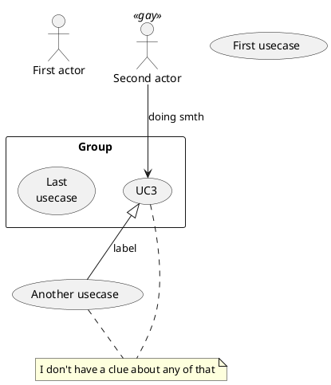
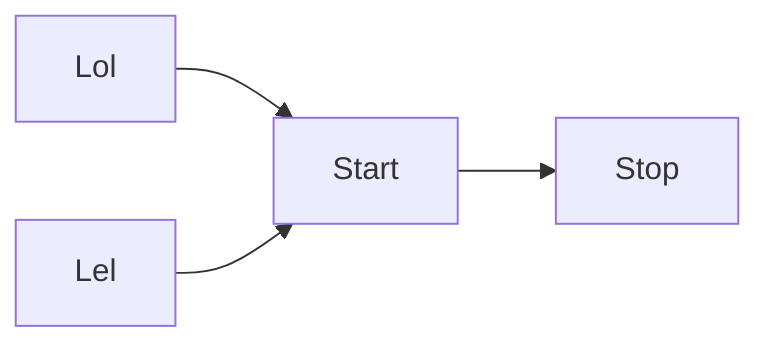

### Полезные сслыки:
* https://www.cloudkarafka.com/plans.html

# Use cases:

Попробую тут юзкейсы описать

```plantuml
:User: as user
:Admin: as admin

admin --|> user

rectangle CreScore as crescoreZone {
    usecase "Посмотреть свои оценки" as checkGrades
    usecase "Посмотреть профиль" as checkProfile
    usecase "Добавить оценку" as addGrade
    usecase "Добавить оценки из интеграции" as addGradesIntegration
}

user --> checkGrades
user --> addGrade
user --> checkProfile

rectangle Integrations {
    rectangle Twitch as TwitchIntegration {
        :Twitch Service: as twitchService

        usecase "Отслеживать опрос" as checkPollTwitch
        usecase "Проголосовать" as voteInPollTwitch
    }
    rectangle Discord as DiscordIntegration {
        :Discord Service: as discordService

        usecase "Отслеживать опрос" as checkPollDiscord
        usecase "Проголосовать" as voteInPollDiscord
    }
}

user --> voteInPollTwitch
user --> voteInPollDiscord

twitchService --> checkPollTwitch
twitchService --> addGradesIntegration

discordService --> checkPollDiscord
discordService --> addGradesIntegration

```


# Tests



## Mermaid works!


